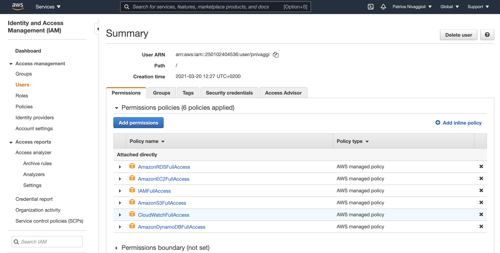

# Terraform AWS Examples

This repo contains examples for managing AWS resources with Terraform. 

## References

*[Terraform: Up and Running](http://www.terraformupandrunning.com)*,
2nd edition, by [Yevgeniy Brikman](http://www.ybrikman.com).

## Pre-requisites

* You must have [Terraform](https://www.terraform.io/) installed on your computer. 
* You must have an [Amazon Web Services (AWS) account](http://aws.amazon.com/).

## Quick start

**Please note that this example will deploy real resources into your AWS account. We have made every effort to ensure 
all the resources qualify for the [AWS Free Tier](https://aws.amazon.com/free/), but we are not responsible for any
charges you may incur.**

On AWS, the initial created account is a root user, use [IAM Service](https://console.aws.amazon.com/iam/home#/home) to create another more-limited account

You need to add the following Managed Policies to your IAM user  

- AmazonEC2FullAccess
- AmazonS3FullAccess
- AmazonDynamoDBFullAccess
- AmazonRDSFullAccess
- CloudWatchFullAccess
- IAMFullAccess


  
Configure your [AWS access 
keys](http://docs.aws.amazon.com/general/latest/gr/aws-sec-cred-types.html#access-keys-and-secret-access-keys) as 
environment variables:

```bash
export AWS_ACCESS_KEY_ID=(your access key id)
export AWS_SECRET_ACCESS_KEY=(your secret access key)
```

Deploy the code:

```bash
terraform init
terraform apply
```

Clean up when you're done:

```bash
terraform destroy
```
